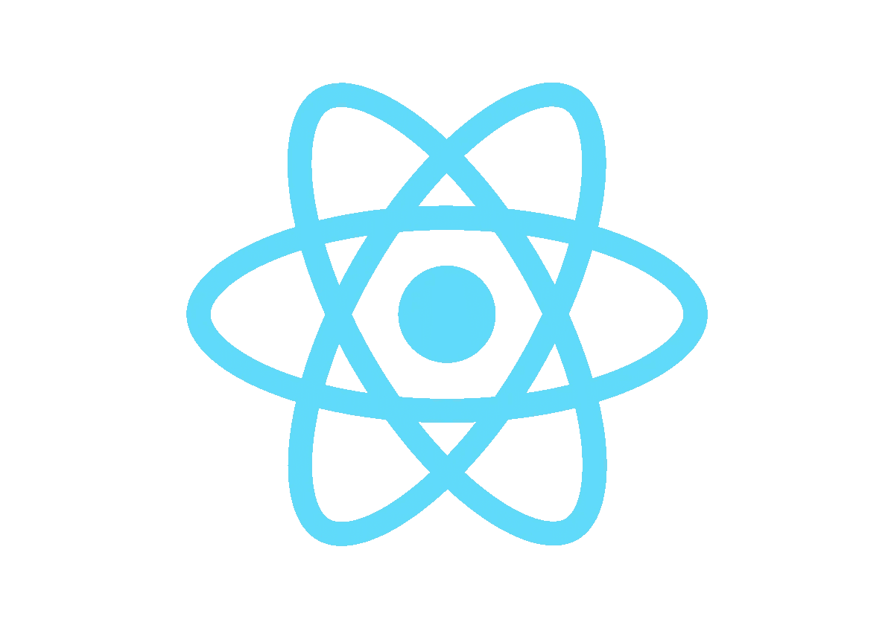
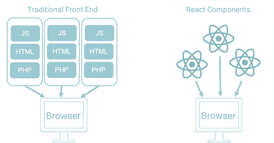
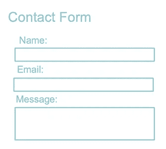
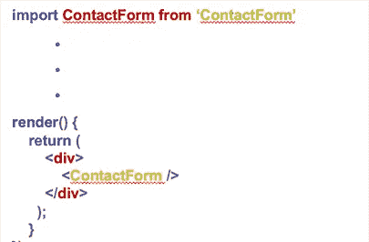

# 为什么我使用 React JS

> 原文：<https://medium.datadriveninvestor.com/why-i-use-react-js-1c301d6cc8dc?source=collection_archive---------5----------------------->

作为 JavaScript (JS)语言世界的新手，我完全不知道等待我的是什么。有了这么多的 JS 库和框架，像我这样的学生怎么知道用哪一个为我未来的客户提供更好的用户体验呢？我对一些优秀的工具做了一些研究。我发现 React JS 是最适合我的。所以我在这里，为像我这样的新手创建一篇文章，以了解 React JS 库为什么很棒以及要走的路。

React JS 于 2013 年 3 月首次发布。与众所周知的 Angular 和 Vue 非常相似。然而，Angular 和 Vue 都是 JS 框架，这意味着它们有更多的功能，涵盖了 MVC(模型-视图-控制器)架构的所有方面。另一方面，React JS 是一个 JS 库，它只关注 MVC 架构的视图方面。视图基本上就是用户看到的东西。这实质上意味着 React 涵盖了网站的用户界面(UI)方面。

MVC Architecture

它的伟大之处在于，它摒弃了传统的前端编程方式，在这种方式下，你有大量的代码写在单独的 html、js 和 php 文件中，然后将它们分组为一个文件夹来表示一个特定的组件。

在 React 中编码，我们使用文件扩展名 JSX，这意味着你可以在每个组件的一个文件中编码你的 html，js 和 php。是不是很棒？因为 React 遵循基于组件的方法，所以您不必再翻遍不同的文件和文件夹来编辑特定的代码。

让我告诉你我为什么喜欢 React。
它将用户界面分解成单独的**可重用的**组件，使扩展用户界面变得容易，创造了灵活性。

那是什么意思？
通过将用户界面分解成独立的可重用部分，我们可以孤立地考虑每个组件。假设我们需要在网站的各个页面上包含这个联系表单，但是我们不想把它单独编码到每个页面上？

Contact Form

没问题，您需要做的就是创建表单的一个副本作为组件，然后，在您想要的任何脚本上导入这个组件，并在您想要组件出现的任何地方的 render 函数下调用它！下面是一个小例子，展示了它的样子。

简单吧？

就像乐高积木一样，如果你想添加另一个组件，只需做同样的导入，调用 render 函数下的积木即可。

如果不知道如何处理组件之间的数据传递，React 库几乎什么都不是。这就是 React 的灵感来源，**支持**和**状态。**第一次听到时，它使用家长对孩子、孩子对家长和孩子对孩子的方法传递数据，这种方法有点难以掌握。但我会尽可能简单地解释。

注意上面代码截图中的渲染函数*(紫色文本)*？每次道具和状态发生变化时，这个渲染都会运行。它只运行自己的渲染功能，不会影响同一页面中的任何其他组件，这使得它作为单页应用程序非常直观和快速。

不要深入研究代码，以免混淆。

> 从一个组件传递到另一个组件的任何数据都被称为 **prop** 。
> 
> 每个组件都有自己单独的**状态**。

另外，因为道具是你传递给另一个组件的东西，所以它不应该被改变。我们可以把状态想象成水的状态，不管它是固态、液态还是气态，它都可以改变。

现在我们知道了什么是道具和状态，我们继续讨论传递的是什么以及如何传递。

状态是每个组件都有的东西，所以我们不把状态传递给其他组件。在组件之间传递的是道具。我们用父子关系来讨论这是怎么做到的。基本上有三种传递数据的方式，那就是

1.  父节点到子节点
    一个**父节点**会使用道具将数据传递给一个**子节点**。
2.  子节点到父节点
    **子节点**不能直接传递数据给**父节点**，所以父节点必须首先设置一个回调，然后才允许子节点传递参数给父节点。
3.  孩子对孩子。
    **Child**to**Child**有点棘手，因为我们知道子节点不能直接将数据传递给父节点，更不用说从一个子节点传递给另一个子节点了。它必须通过父对象，然后父对象将道具传递给另一个子对象，如父对象与子对象以及子对象与父对象关系中所述。

通过彻底理解组件之间的数据传递以及 props 和 state 的概念，我开始充分欣赏 React JS，并能够在我的 UI 开发中使用它。

我希望我已经设法简化了 React JS 的基本概念。因为当我第一次开始研究这个 JS 库时，我很难理解它到底是什么，而且那里的许多资源对我来说太高级了，难以消化。

*为我的第一篇文章干杯！*