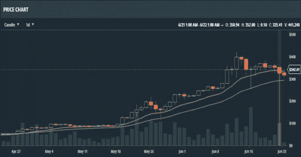

# 加密货币会取代法定货币吗？(第二部分)

> 原文：<https://medium.datadriveninvestor.com/will-cryptos-ever-replace-fiat-currency-part-ii-db13c1d18a91?source=collection_archive---------5----------------------->

在[之前的帖子](http://www.datadriveninvestor.com/2017/08/09/will-cryptos-ever-replace-fiat-currency-part-1-of-2/)中，我们回顾了大多数加密货币共有的一些特性，这些特性使它们成为法定货币的可行替代品。现在让我们来探讨一下它们的一些局限性。

由于供应在技术上是固定的，加密货币在设计上通常是通缩的。然而，它的固定供应也可能是它的致命弱点。与黄金非常相似，面对固定、无弹性的供应，加密货币需求的任何重大变化都将导致价格剧烈波动。

看看以太坊在 2017 年 6 月 22 日发生了什么，此前有传言称它在 319 美元左右遭到了数百万美元的抛售。价格在几秒钟内跌至 0.10 美元的日低点，半小时后反弹至 280 美元以上。

如果比特币、以太或任何其他加密货币继续遭受我们目前看到的那种价格不稳定，那么它作为一种广泛的交易媒介将变得不切实际。固定供应的积极属性通过投资者的预期影响了流动性问题。

此外，在货币应该具备的所有可取品质中，可以说最关键的品质是流动性。“钱”必须是最具流动性的资产，因为我们需要它来支付任何事情，而且总是在一瞬间。目前，没有一种加密货币满足这一标准。

最终流通的最大 2100 万比特币可能最终会满足这一要求……但也可能不会。此外，法定货币已经相当有效地做到了这一点。事实上，这可能是菲亚特最大的可取之处——*人们今天希望执行交易，他们不太关心他们对一种货币的生存有没有信心*。如果法定货币继续保持比加密货币更具流动性和便利性的优势，那么说服大众做出改变将是一个不可逾越的挑战。

当然， *cryptos* 的支持者可能会辩称，如今有大量不同的硬币，每枚硬币都代表着从一组特定功能中获得的价值，这些功能可以在各自的区块链上执行——比特币用于支付。以太用于智能合约。Ripple 用于结算和汇款。但是，陪审团仍然不知道在这些加密货币之间进行交易来执行特定任务是否会比我们目前使用的法定系统更方便。

这让我们想到了反对“秘密未来”的最有说服力的论据。经济政策的实施主要是为了在一国境内产生影响。但加密货币忽略了地理边界——它实际上是无国界的，并以“每个行业”为基础进行操作。如果货币不是在“每个国家”的基础上决定的，那么货币和财政政策的效果将会大打折扣。

相反，可能出现的是一种“混合体”——一种政府支持的加密货币。事实上，央行现在正在考虑这样一个选择。英格兰银行首席经济学家安迪·霍尔丹(Andy Haldane)表示，它将允许央行对货币收取负利率，这在目前是不可能的，因为纸币的广泛流通可以简单地存放在保险箱(或“床垫下”)中以保持其价值，而不是必须向银行支付存款。从纸质货币到数字货币的转变将阻止人们拥有纸币安全网。央行也可能希望提供自己的数字货币，以此作为打击逃税、洗钱和其他非法活动的一种方式——这些问题在比特币存在的短暂时间里一直困扰着它。

对于央行对数字货币的兴趣——以及为什么加密货币不会取而代之——一个更愤世嫉俗的解释是，央行不太可能放弃目前对货币的垄断控制。他们似乎不太可能简单地靠边站，让加密货币削弱他们目前拥有的权力。如果加密货币继续快速发展，一大堆监管措施肯定会出台；事实上，7 月 25 日[证券交易委员会裁定](https://www.sec.gov/litigation/investreport/34-81207.pdf)道代币构成一种“证券”并应受到现有证券法的监管，这很可能只是一个开始。

央行和监管者不那么谨慎还有其他原因。当我们将当前的加密货币热潮放入背景中时，在本文撰写之时，所有现有加密货币的市值目前约为 1000-1500 亿美元，其中比特币占不到一半。鉴于全球对更多硬币的贪婪需求——正如我们今年看到的新初始硬币发行(ico)的冲击所证明的那样——这一数字在未来几个月和几年只会继续上升。也就是说，全球“狭义货币”——即包括所有实物货币和活期存款以及央行持有的其他流动资产在内的货币供应量——的总和高达 31 万亿美元。这是加密货币总市值的 300 多倍。世界上所有黄金的当前价值超过 8 万亿美元。显然，比特币或任何其他硬币在达到与法定货币或黄金同等规模之前还有很长的路要走。

**最终判决**

看起来最有可能的结果是，法定货币将无限期地继续下去，但最终将与几种加密货币并行运行，每种货币都有自己的特定特征和功能。这将削弱菲亚特的垄断地位，但它仍将是全球事实上的*选择。*

最终，在现阶段得出任何具体结论还为时过早。比特币才流通了几年。必然会经历更多的波峰波谷。鉴于我们已经看到了黄金和美元可能发生的一切，我们几乎没有触及加密货币的表面。

关于数字货币作为交易媒介的功效，还有许多问题需要回答。例如，一旦 2100 万枚比特币全部流通，会发生什么？如果没有新的硬币作为奖励，矿工们将如何谋生？矿工的数量会减少吗？结果，网络会变得*集中*吗？这将使加密货币与其设计初衷背道而驰吗？甚至比特币最近的缩放问题也向我们展示了加密货币社区分裂可能导致的戏剧——以及相关的价格波动。很可能会有更多的戏剧在酝酿中，不仅仅是比特币，还有以太坊和其他替代货币。

加密货币需要继续发展。但在这个新生阶段，如此多的问题悬而未决，这一事实突显出，如果它要接管世界，未来的挑战是多么艰巨。

*原载于 2017 年 8 月 20 日*[*【www.datadriveninvestor.com】*](http://www.datadriveninvestor.com/2017/08/20/will-cryptos-ever-replace-fiat-currency-part-2-of-2/)*。*