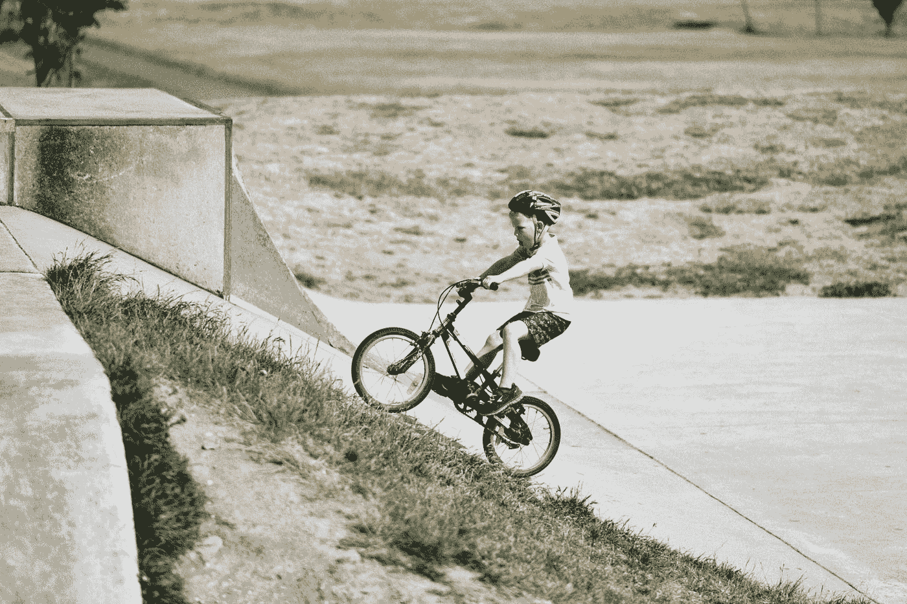

# 通过机器学习预测伤口愈合进程

> 原文：<https://medium.datadriveninvestor.com/wound-healing-progress-prediction-through-machine-learning-aa05c3b50b35?source=collection_archive---------21----------------------->

Photo by [童 彤](https://unsplash.com/@liz99?utm_source=medium&utm_medium=referral) on [Unsplash](https://unsplash.com?utm_source=medium&utm_medium=referral)

为临床医生配备一个准确的预测伤口愈合模型在病人的分类和护理中将是非常重要的。这将允许及时诊断，并通过确保临床医生对创伤愈合受损的患者实施积极的治疗方法来降低治疗成本。伤口愈合正常的患者可以在不需要频繁去诊所的情况下得到治疗。

通常，患者的伤口愈合受到损害，通常称为慢性伤口。慢性伤口在糖尿病患者和老年人群中更常见。仅在美国，就有大约 650 万人受其影响。这些伤口不能及时愈合，反而导致并发症，可能导致截肢或甚至致命的感染。快速和积极的治疗要求临床医生能够在初始治疗阶段将慢性伤口与其他伤口区分开来。

目前，如果伤口在给定时间内没有充分愈合，临床医生必须在重新评估给定治疗之前观察伤口愈合数周。慢性伤口非常容易感染，诊断和有效治疗的延误会引起并发症，使情况恶化。

为了解决这个问题，斯坦福大学和 Healogics Inc .使用机器学习方法和特征工程设计并开发了一个延迟伤口愈合的预测模型。该模型输入了一个训练数据集，其中量化的伤口特征(包括伤口面积、深度、长度和宽度)用于训练该模型。数据集包括间隔一周的第一次和第二次伤口评估。该模型能够高精度地成功区分正常和延迟伤口愈合。

机器学习在医疗保健中的价值是使用大量的患者健康数据，并将分析结果可靠地转换为临床见解，以帮助临床医生规划和提供护理。从而导致更好的治疗、更低的护理成本和更高的患者满意度。