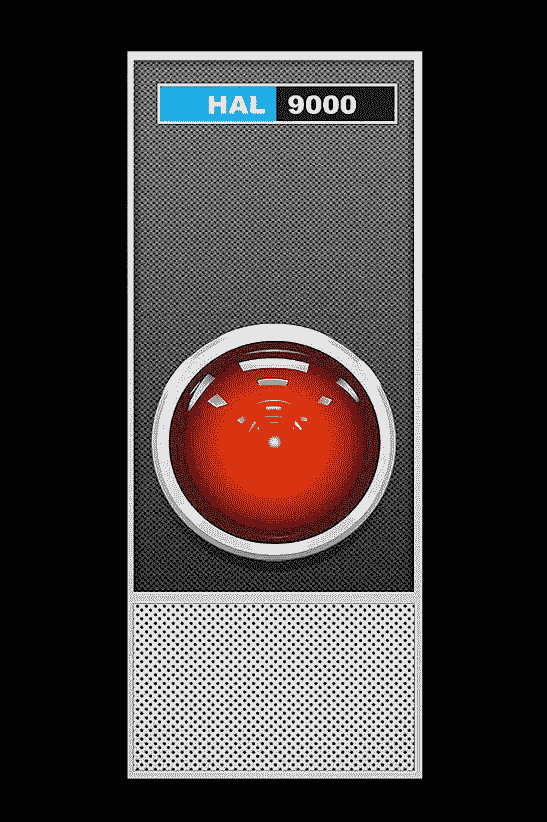

# 围绕着机器学习和人工智能，以及我所发现的。

> 原文：<https://medium.datadriveninvestor.com/wrapping-my-head-around-machine-learning-and-ai-and-what-ive-figured-out-64d9d04661a3?source=collection_archive---------2----------------------->

I’m sorry, Dave. I’m afraid I cannot do that…

最近我在谷歌的云平台博客上读到了一篇有趣的文章，讲述了一位日本黄瓜农民使用 Arduino、Raspberry Pi 和谷歌的机器学习技术构建了一个家庭酿造自动化系统来分拣黄瓜。有一个短片展示了这个系统的运行。用树莓 Pi 控制的摄像机以三种不同的方式拍摄黄瓜。这些图像被发送到谷歌云，在那里对它们的形状、大小和厚度等特征进行分析。根据分析的结果，黄瓜可以分为九个不同的类别。黄瓜然后在传送带
上移动，直到它到达一个位置，在那里它可以根据分类被踢到一个箱子里。踢球器、致动器和传送带，基本上所有的机械运动部件，都由微控制器 Arduino 协调。机器学习(ML)是我们称之为人工智能(AI)的更广泛概括的子集。它的工作原理是向计算机大脑输入大量数据，例如数千张不同形状和大小的黄瓜图像，这样它就可以接受训练，对它们进行正确分类。谷歌的 AlphaGo 也采用了同样的技术，打败了围棋世界冠军 Lee Sedol。这是一个令人震惊的事件，促使许多人第一次认真对待人工智能。事实上，建造黄瓜分类机的农民小池诚(Makoto Koike)表示，他的努力受到了 AlphaGo 胜利的启发。如果一种机器学习算法能够在围棋等复杂游戏中击败最优秀的人类，那么它肯定能够对黄瓜进行分类。

我之所以选择讲述这个故事，是因为它揭示了一些值得注意的事实，即正在发生的人工智能现象。一个黄瓜农民建造了一个自动的、图像识别的、智能的决策系统来解决他工作中的一个特殊问题。通过这个例子，非专家也能接触到人工智能的程度令人震惊。你不一定需要一个计算机科学博士学位或对高等数学有深刻的理解才能参与这个游戏。不，谷歌已经帮你完成了繁重的工作，把它们打包成高级抽象，瞧……ML 即服务。你所需要做的就是遵循谷歌教程，该教程展示了如何使用这项服务，弄清楚如何将其集成到一个更大的系统中，该系统包括一个 Raspberry Pi 和一个 Arduino，以及很多很多的 DIY 勇气。
这种稀薄技术的民主化似乎正在推动另一种趋势。人工智能技术似乎越来越多地被用来解决看似平凡的问题。当我第一次遇到小池先生的故事时，我的第一反应是…黄瓜？真的吗？我认为我们已经被所有关于机器人和自动驾驶汽车的媒体报道宠坏了。给蔬菜分类似乎并不性感或迷人。但事实证明，如果你是一个黄瓜农民，这是一件大事。显然在日本，顾客对他们的黄瓜非常挑剔。他们必须是直的，大小一致，有一定的颜色，并拥有适量的表面刺痒感。这些要求更高的价格。弯曲的被认为是低质量的，即使它们尝起来是一样的。此外，分拣黄瓜是枯燥的，重复的，非常耗时的体力劳动。因此，尽管对我们其他人来说，这似乎是一个非常平凡的问题，
但是，这并不意味着这是一个微不足道的问题，也不意味着大量的时间和金钱不会受到威胁。最近我读了一篇关于哥伦比亚大学的两位数据科学家的媒体文章，他们致力于建立一个 ML 模型来预测 NYU 兰贡医疗中心的病床可用性。再说一次，这不是治愈癌症或火星太空旅行。但我敢打赌，预测繁忙的大城市医院的床位可用性对医院管理者来说非常重要。或者对刚做完手术的病人。我可以从个人经历中证明这一点。六个小时的脑部手术后，麻醉逐渐消失，我醒来时感到有生以来最可怕的头痛。令人惊讶的是我还在手术室里。我无意中听到房间里的两个技术人员在谈论我，透过我术后疼痛和昏迷的迷雾，我意识到他们正在等待一张空床。这些技术人员不是护士，这意味着他们不能服用止痛药。我得到止痛药的唯一方法是在我被推进房间搬到床上之后。这发生之前花了将近两个小时，但感觉像永远。

人工智能被描绘成负面的。有很多恐惧在蔓延。人类被旨在非人化的宣传妖魔化。机器被妖魔化是因为它们变得越来越像人类。最大的担忧是，越来越熟练的人工智能将接管低技能工作，导致大规模失业和社会混乱。但显然，我们谦逊的黄瓜农民小池先生并没有被这些所困扰。他对 AlphaGo 获胜的反应不是“天哪，他们在围棋上打败了我们！他们会消灭我们的！”因为我们人类投射出自己的暴力倾向，并把恶性意图归因于那些显示出任何知觉迹象的机器。所以很自然地，一台机器可以熟练地移动木板上的黑白石头的概念意味着“他们接下来会把我们消灭掉”。小池先生并不担心人工智能引发的大屠杀，也不担心失去工作。相反，他的态度是“我如何利用这一点来使我受益？我怎么能从中获利呢？”我认为这是思考这一切的正确方式。毫无疑问，如果你是一名卡车司机，未来似乎并不乐观。但是开卡车很无聊、危险、不健康，因为你吃的大多是垃圾食品，而且要坐很长时间。暂且把就业问题放在一边，如果机器做了像卡车驾驶这样的所有工作，这个世界将会变得更加美好。或者挑选成百上千的黄瓜。事实上，如果你不是工人或雇员，尤其是低技能的，人工智能自动化似乎是一个美妙的想法。作为一个小型家庭农场企业的部分所有者，小池先生并不担心失业。相反，人工智能为他节省了大量体力劳动，并为他赚了更多的钱。

所以我想诀窍是以某种方式将自己定位在人工智能革命的胜利一方。数据科学是另一个热门的新兴领域，与 ML 和 AI 密切相关。我上面给出的关于预测医院病床可用性的例子更多的是一个数据科学应用，而不是人工智能本身。但这在很大程度上是一个技术性问题，因为底层的数学机器、代码、算法和数据处理看起来非常相似。数据科学(以及 ML 和 AI)是关于使用经验主义来寻找模式以提取意义和价值。现在这个定义离描述常规科学(生物学、化学、物理学)是如何工作的已经不远了。在启蒙运动期间，经验主义和科学方法取代了神话和迷信来解释物质世界是如何运作的。这是一场革命。在 19 世纪，有创造力的人开始应用经验主义和科学方法来解决传统科学之外的问题。在英国，一位名叫约翰·斯诺的医生正在处理一场霍乱疫情。他在地图上标出了有霍乱感染的地点。他发现数据点聚集在布罗德街的水泵周围。事实上，那个水泵里的水被污染了。关闭水泵导致新事故大幅下降。这就是数据科学，没有计算机的帮助。也许是受这个著名的宽街霍乱爆发的例子的启发，警察和侦探开始使用类似的技术来解决犯罪，因此产生了法医学领域(和夏洛克·福尔摩斯)。今天发生了什么事？在人工智能、人工智能或数据科学的幌子下，经验主义和科学方法正被应用于所有的现实，下至最平凡和个人的事物。黄瓜、医院病床、亚马逊或网飞上基于你的口味的推荐引擎……无穷无尽。这一切都是由计算能力、存储和可用性方面的巨大进步推动的，而这在以前是不存在的。个别项目可能看起来很平凡，但事实是，在丰富、无处不在的计算能力的帮助下，用于理解传统科学(现实的一个子集)中事物的同样强大的方法现在正被用于理解*所有的现实或人类经验*，这对任何会停下来意识到这是多么深刻的人来说都应该是令人兴奋的。现在我们有点开始明白所有的炒作是怎么回事了。但我怀疑是否有人这样解释过。看哪，一个启蒙的新时代？除非我们克服了恐惧。

游戏里我的皮肤是什么？我有一个五岁的儿子，快六岁了。我的目标是和儿子一起造一个类似小池的分拣机的东西。也许是乐高积木分类机？他有很多乐高积木。因为如果 ML 能打败围棋世界冠军，肯定能给黄瓜排序。如果 ML 能给黄瓜分类，它肯定也能给乐高积木分类吧？我认为就图像识别和分类而言，这将是一个更简单的问题；黄瓜太不规则了。如果一个黄瓜种植者可以做 ML，那么一个 8 岁、9 岁或 10 岁的孩子也可以吗？我希望检验这一假设，以确定年轻人能够掌握建造基于 ML 的乐高积木分类机的概念。这样的项目意味着学习数学、逻辑、编码，使用 Arduino 控制机械运动部件，这基本上是机器人技术。这是孩子们的终极 STEM 训练营。我会在博客上分享一切，这样每个人都可以看到进展如何。